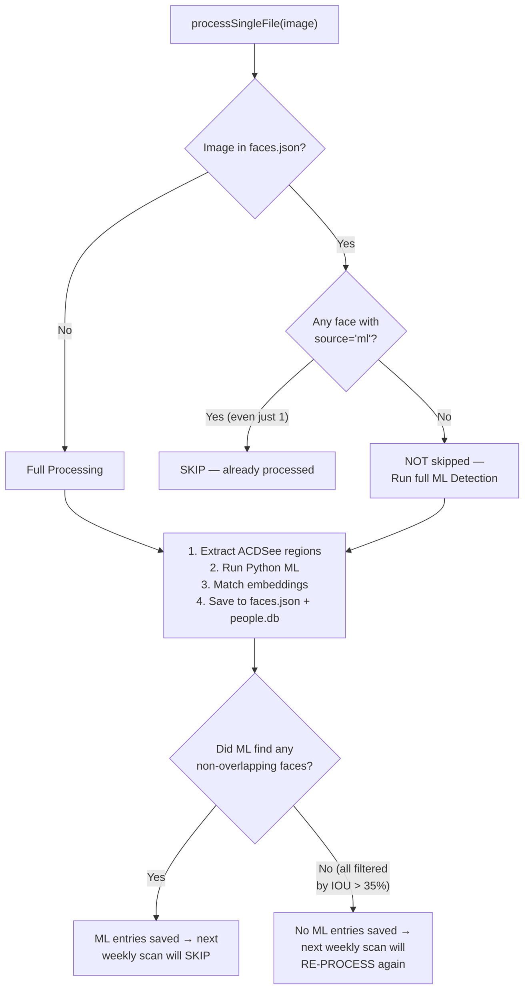
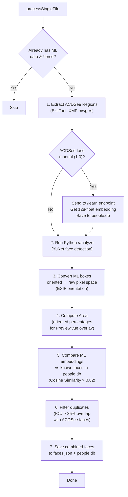
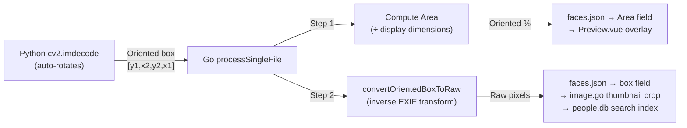
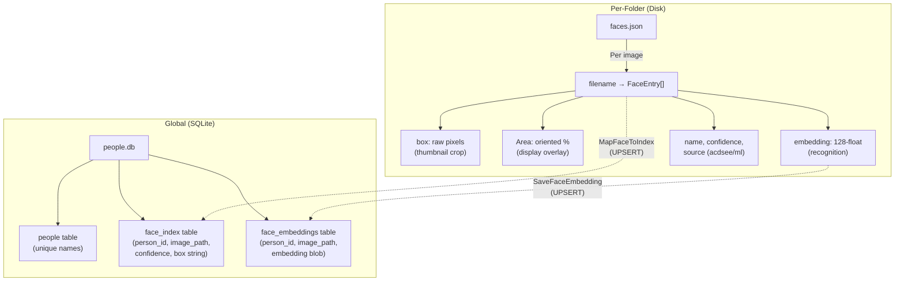

# FileBrowser Quantum - Architecture Documentation

## Table of Contents
1. [Heatmap Cluster ID Architecture](#heatmap-cluster-id-architecture)
    - [Cluster ID Generation](#cluster-id-generation)
    - [Folder Hierarchy & Percolation](#folder-hierarchy-&-percolation)
    - [Manual Regeneration & Cleanup](#manual-regeneration)
2. [Backend Architecture](#backend-architecture)
3. [Frontend Architecture](#frontend-architecture)
4. [File Viewing](#file-viewing)
5. [Data Flow](#data-flow)
6. [Image Editing Features](#image-editing-features)
    - [Map Tab Details](#2-location-editing-map-tab)
    - [Rotation](#3-image-rotation-temporary)
7. [Server Permissions](#collection-folder-permissions)
8. [Administrative Functions](#administrative-functions)
9. [New Folder Highlighting](#new-folder-highlighting)
10. [Documentation Notes](#documentation-notes)
11. [Share Link System](#12-share-link-system)
12. [Mobile Interaction](#13-mobile-interaction)
13. [Background Scans & Jobs](#14-background-scans--jobs)
    - [Job Summary Table](#job-summary)

14. [Sticky Header Breadcrumb](#15-sticky-header-breadcrumb)
15. [Heatmap Inspection Panel Navigation](#16-heatmap-inspection-panel-navigation)
16. [Face Recognition Architecture](#16-face-recognition-architecture)

---

## 12. Share Link System

[↑ Back to Top](#table-of-contents)

### Overview
The share link system allows users to create public, time-limited, and password-protected links to files and folders.

### Path Resolution Logic
To support multiple storage roots and user aliases, share links use a robust resolution strategy:

1.  **Frontend Request**: Sends `path` (relative to source/alias) and `source` (e.g., "POWELL" or "POWELL:1").
2.  **Source/Alias Resolution** (`GetScopeFromSourceString`):
    *   Handles `Name:Index` format (e.g., "POWELL:1") by stripping the index.
    *   Resolves Aliases to Real Source Paths (e.g., "POWELL" -> `/PHOTOCOLLECTIONS/POWELL-COLLECTION`).
    *   **Admin Fallback**: If standard scope lookup fails (e.g., Admin has no specific scopes), the system checks global sources directly.
3.  **Path Construction**:
    *   The **Scope Path** (hidden internal path) is prepended to the **File Path**.
    *   Example: `Source="E:\PHOTOS"`, `Scope="/Vacation"`, `File="/beach.jpg"` -> `Real Path = E:\PHOTOS\Vacation\beach.jpg`.
    *   This ensures links point to the correct physical location even when using complex aliases.

### Expiration Enforcement
Expiration is enforced at the database level (`GetByHash`):
*   Links with `expire < time.Now()` return `ErrNotExist`.
*   This ensures expired links appear as 404s and cannot be accessed even if the token is known.

---

## 13. Mobile Interaction

[↑ Back to Top](#table-of-contents)

### Context Menu (Long Press)
To support touch devices (iPad, Android Tablets, Mobile):
*   **Touch Handling**: `ListingItem.vue` listens for `touchstart`, `touchmove`, and `touchend`.
*   **Long Press Detection**: A timer (500ms) triggers the context menu if no movement (swipe) is detected.
*   **Universal Support**: The logic is **device-agnostic** (previously restricted to Safari) to ensure consistent behavior across all mobile browsers (Chrome on iOS, Firefox on Android, etc.).

---

## Heatmap Cluster ID Architecture

[↑ Back to Top](#table-of-contents)

### Overview
The heatmap system creates geographic clusters of images based on GPS coordinates and percolates them up through the folder hierarchy.

### Cluster ID Generation

**Location**: `backend/heatmap/scanner.go`

```go
genID := func() string {
    return fmt.Sprintf("%d-%d", time.Now().UnixNano(), len(points))
}
```

- **Format**: `[TimestampNano]-[SequenceIndex]`
- **Uniqueness**:
    - The ID is unique to the *specific scan execution* and the *file's position* in the scan order.
    - **Regeneration Impact**: Every time a heatmap is regenerated, **NEW IDs** are generated for every cluster and point.
    - **Persistence**: IDs are NOT persistent across scans. Clients must reload the heatmap data after a regeneration event to get valid IDs.
- **Per Geographic Location**: Multiple clusters per folder based on GPS proximity
- **Cluster Radius**: 0.0005 degrees (~50 meters)

### Folder Hierarchy & Percolation

```
/photos/vacation/
├── heatmap.json (v3)
│   └── clusters: [
│       { id: "1738...-0", lat: 40.7, lon: -74.0, count: 15, path: "day1/IMG_001.jpg" },
│       { id: "1738...-1", lat: 40.8, lon: -74.1, count: 13, path: "day2/IMG_050.jpg" }
│   ]
├── day1/
│   └── heatmap.json
│       └── clusters: [
│           { id: "1738...-0", points: [15 images] }
│       ]
└── day2/
    └── heatmap.json
        └── clusters: [
            { id: "1738...-1", points: [13 images] }
        ]
```

### Percolation Process

**Location**: `backend/heatmap/manager.go`

1. **Leaf Level** (`GetLocalClusters`):
   - Scans folder for images
   - Extracts GPS coordinates
   - Creates clusters (merges nearby points)
   - Assigns random IDs
   - Saves to `heatmap.json`

2. **Aggregation** (`AggregateLevel`):
   - Reads child `heatmap.json` files
   - Strips `Points` array (keeps metadata)
   - **Preserves cluster ID from leaf level**
   - **Keeps preview image URL** (`PreviewID` and `Path`)
   - Merges with local clusters
   - Saves aggregated `heatmap.json`

3. **Percolate Up** (`PercolateUp`):
   - Recursively updates parent folders
   - **Clusters and their IDs percolate all the way up**
   - **Sample preview image URL maintained** throughout hierarchy
   - Continues to source root
   - Called by **both** `ScanSafe` (manual regeneration) **and** `StartJob` (automatic weekly scan) after each `ScanRecursive` completes — this was a bug fix (see [Known Bug Fixes](#known-bug-fixes-percolation))

### Inspection Flow

**Frontend → Backend**:
```
User clicks cluster badge "28 items"
  ↓
Frontend sends: /api/heatmap/inspect?lat=40.7&lon=-74.0&cluster_id=1738...-0
  ↓
Backend (heatmap_inspect.go):
  1. Loads folder heatmap.json
  2. Finds cluster by ID: lc.ID == c.ID
  3. Returns lc.Points (all images in that geographic cluster)
  ↓
Frontend displays 28 images in inspection panel
```

### Version Management

**Location**: `backend/heatmap/types.go`

```go
const HeatmapVersion = 7
```

| Version | Change |
|---------|--------|
| 4 | Fix for missing IDs in frontend inspection |
| 5 | Added `TotalImageCount` field |
| 6 | Force full re-scan after cluster percolation bug fixes |
| 7 | Force full re-scan after child-freshness skip logic fix |

- Incrementing this constant forces a complete re-scan of all `heatmap.json` files on next server startup (version mismatch causes `AggregateLevel` to treat existing files as stale).
- The scan starts ~1 minute after server startup, then repeats every `ScanIntervalDays` (7 days).

### Known Bug Fixes — Percolation

#### Bug 1 — `StartJob` was missing `PercolateUp` call *(Fixed)*

The automatic weekly background scan (`StartJob`) called `ScanRecursive` per scope path but **never called `PercolateUp`** afterwards. This meant parent folders (up to the source root) were never updated during automatic scans. Manual regeneration via `ScanSafe` did call `PercolateUp`, which is why clicking "Regenerate" in the UI worked but the automatic scan did not propagate clusters upward.

**Fix** (in `StartJob`, `manager.go`):
```go
_, err := ScanRecursive(sourceName, path, nil, sem, false)
if err == nil {
    PercolateUp(sourceName, path)
}
```

#### Bug 2 — Overly broad path deduplication in `AggregateLevel` *(Fixed)*

When reading child `heatmap.json` files in `AggregateLevel`, the code used `strings.Contains` to detect whether a cluster path already contained a subfolder name — to avoid double-prepending. This check was too broad: a subfolder named `"day"` would match any path containing the substring `"day"` (e.g., `"holiday/beach.jpg"`).

Since `GetLocalClusters` saves cluster paths as **absolute from the source root** (e.g., `/vacation/day1/img.jpg`), the correct check is simply whether the path starts with `/`.

**Fix** (in `AggregateLevel`, `manager.go`):
```go
if strings.HasPrefix(cleanPath, "/") {
    data.Clusters[i].Path = cleanPath
// removed: } else if strings.Contains(pathLower, subLower) { ...
} else {
    data.Clusters[i].Path = filepath.ToSlash(filepath.Join(subName, cleanPath))
}
```

#### Bug 3 — Parent folder skipped even when child heatmap was updated *(Fixed)*

The skip logic in `AggregateLevel` returned early (without re-aggregating) whenever a `heatmap.json` had the current version **and** was younger than 7 days — even if a child's `heatmap.json` had been updated more recently. This meant a freshly-regenerated child folder would never bubble its new clusters up into the parent during the same run.

The fix adds a **child-freshness check**: before skipping, the code checks via `os.Stat` whether any direct child's `heatmap.json` has a `ModTime` newer than the parent's `GeneratedAt`. If so, the parent falls through to a full re-aggregation.

**Fix** (in `AggregateLevel`, `manager.go`):
```go
childNewer := false
if childDirInfo, childExists := idx.GetReducedMetadata(rootPath, true); childExists {
    for _, sub := range childDirInfo.Folders {
        childRealPath, _, cerr := idx.GetRealPath(filepath.Join(rootPath, sub.Name))
        if cerr == nil {
            if info, serr := os.Stat(filepath.Join(childRealPath, HeatmapFilename)); serr == nil {
                if info.ModTime().After(existingData.GeneratedAt) {
                    childNewer = true
                    break
                }
            }
        }
    }
}
if !childNewer {
    return existingData.Clusters, nil // safe to skip
}
// otherwise: fall through and re-aggregate
```

New log messages:
- **`Heatmap [SKIP  ]`** — nothing changed underneath, skipped as before
- **`Heatmap [RE-AGG]`** — a child was updated more recently, parent is re-aggregating

### Manual Regeneration & Cleanup

To allow users to fix missing or corrupted data without a full system re-scan:

**Endpoint**: `POST /api/heatmap/regenerate?path=/path/to/folder`

**Triggers**:
1.  **UI Button**: A refresh icon in the Heatmap Side Panel header allows regenerating the currently inspected folder.
2.  **Logic**: Bypasses the 7-day interval check and forces a rebuild of the `heatmap.json` for the target folder.

**Process Flow & Integrity**:

1.  **Local Rebuild (`ScanRecursive`)**:
    - Scans the target folder and its subfolders for images.
    - Extracts GPS data (using robust individual file processing).
    - **Replaces** the local `heatmap.json` entirely.
    - **Cleanup**: Any clusters from deleted files are automatically removed because the file is regenerated from scratch.

2.  **Percolation Upwards (`PercolateUp`)**:
    - Immediately after a folder is updated, the system walks **UP** the directory tree to the source root.
    - At each parent level, it performs an **Aggregation**:
        - Reads `heatmap.json` from all child subfolders.
        - Combines them into a new parent `heatmap.json`.
    - **Propagation**: This ensures that valid clusters bubble up, and removed clusters are dropped from parents, keeping the entire hierarchy consistent.


---

## Backend Architecture

[↑ Back to Top](#table-of-contents)

### Directory Structure

```
backend/
├── adapters/          # External integrations
│   └── fs/           # Filesystem operations
├── auth/             # Authentication & authorization
├── cmd/              # CLI commands
├── common/           # Shared utilities
├── database/         # Data persistence
│   ├── storage/      # Storage interface
│   ├── users/        # User management
│   └── settings/     # Settings management
├── events/           # Event system
├── heatmap/          # Heatmap generation
├── http/             # HTTP handlers & API
├── indexing/         # File indexing system
├── preview/          # Image/video preview generation
└── swagger/          # API documentation
```

### Core Components

#### 1. Database Layer
**Location**: `backend/database/`

- **Storage**: Bolt DB wrapper
- **Users**: User accounts, permissions, scopes
- **Settings**: Application configuration

#### 2. Indexing System
**Location**: `backend/indexing/`

- **Purpose**: Fast file metadata access
- **Index Structure**: In-memory tree of folders/files
- **Metadata**: Name, size, modified time, type
- **Sources**: Multiple root directories (e.g., PHOTOS, VIDEOS)

#### 3. Authentication
**Location**: `backend/auth/`

- JWT-based authentication
- User scopes (folder access control)
- Permission system (admin, create, rename, etc.)

#### 4. HTTP Layer
**Location**: `backend/http/`

- RESTful API endpoints
- File operations (upload, download, delete)
- Heatmap API (`heatmap_inspect.go`, `heatmap_tiles.go`)
- Preview API (thumbnails, EXIF)

#### 5. Preview System
**Location**: `backend/preview/`

- **Thumbnail Generation**:
    - **Small**: 256x256 high-quality thumbnail.
    - **Thumb**: 64x64 tiny icon.
    - **Orientation**: Uses `imaging.AutoOrientation(true)` for standard previews. For face crops (`boxParam`), the system decodes the raw image, applies the crop, and then manually applies the EXIF orientation transformation to ensure the crop coordinates remain accurate to the original pixel grid while the output is correctly rotated.
- **EXIF Metadata**: Extraction of IPTC, XMP, and standard EXIF tags.
- **Video frame extraction**: Uses FFmpeg to pull frames.
- **Caching**: Persistent disk-based cache using hashed filenames.
- **Rebuild Mechanism**: The `rebuildThumbnails` API allows invalidating the cache for a folder and its subdirectories by recursively walking the directory and deleting corresponding cache files.

#### 6. Heatmap System
**Location**: `backend/heatmap/`

**Files**:
- `scanner.go`: GPS extraction, clustering
- `manager.go`: Recursive scanning, aggregation, percolation
- `tiles.go`: Tile coordinate conversion
- `types.go`: Data structures, version
- `monitor.go`: Active scan tracking

**Data Flow**:
```
StartJob (weekly cycle)
  ↓
ScanRecursive (for each user scope)
  ↓
GetLocalClusters (leaf folders)
  ↓
clusterPoints (merge nearby GPS)
  ↓
AggregateLevel (combine local + children)
  ↓
PercolateUp (update parents)
```

**Scan Interval Configuration**:

**Constant**: `ScanIntervalDays = 7` (in `backend/heatmap/manager.go`)

- **Full Scan**: Runs every 7 days (weekly)
- **Skip Logic**: Folders with heatmap.json < 7 days old are skipped during automatic scans
- **Manual Scans**: Override the interval, always regenerate, and percolate up immediately
- **Rationale**: Full scans take 6+ hours for large photo libraries, weekly is sufficient

**To Change Interval**: Modify `ScanIntervalDays` constant in `backend/heatmap/manager.go`

**Total Image Count Feature**:

**Purpose**: Displays the total number of images in a folder (including non-geotagged photos) in the heatmap inspection panel. This helps users understand the complete scope of images in each location, even if some photos lack GPS data and aren't visible on the map.

**Implementation**:
- **Backend** (`backend/heatmap/scanner.go`):
  - `GetLocalClusters` counts all images in a folder during scan
  - Assigns `TotalImageCount` to all clusters and points for that folder
  - Field added to `Cluster` and `ClusterPoint` structs in `types.go`
- **Backend** (`backend/http/heatmap_inspect.go`):
  - Propagates `TotalImageCount` from clusters to points in API responses
  - Four propagation points ensure consistent delivery to frontend
- **Frontend** (`frontend/src/views/Heatmap.vue`):
  - Maps `totalImageCount` from API responses
  - Preserves count when drilling down into folders via `openFolderView`
  - Displays "Total Folder Image Count: X" below folder name in inspection panel header

**Version**: Introduced in HeatmapVersion 5

---

## New Folder Highlighting

[↑ Back to Top](#table-of-contents)

### Overview

The new folder highlighting feature visually indicates folders that have been created or modified within a configurable time window. This helps users quickly identify recent additions to the file system.

### Configuration

**File**: `backend/indexing/iteminfo/fileinfo.go`

**Constant**: `NewFolderHighlightDays = 30`

```go
// NewFolderHighlightDays defines how many days a folder should be highlighted as "new"
const NewFolderHighlightDays = 30
```

**To Change the Duration**:
1. Edit the constant in `fileinfo.go`
2. Rebuild the backend: `go build -o backend.exe`
3. Restart the application

**Common Configurations**:
- `7` = 1 week
- `14` = 2 weeks
- `30` = 1 month (default)
- `60` = 2 months
- `90` = 3 months

### Backend Implementation

#### Data Structure

**Location**: `backend/indexing/iteminfo/fileinfo.go`

```go
type ItemInfo struct {
    Name        string    `json:"name"`
    Size        int64     `json:"size"`
    ModTime     time.Time `json:"modified"`
    Type        string    `json:"type"`
    Hidden      bool      `json:"hidden"`
    IsNew       bool      `json:"isNew"`       // Folder is new
    ContainsNew bool      `json:"containsNew"` // Folder contains new items
}
```

**Fields**:
- `IsNew`: True if the folder itself was created/modified within `NewFolderHighlightDays`
- `ContainsNew`: True if the folder contains new subfolders or files (hierarchical)

#### Indexing Logic

**Location**: `backend/indexing/indexingFiles.go` (lines 168-177)

**Method**: Uses **File Birth Time** (Creation Time) to avoid false positives from heatmap scans (which update ModTime).

```go
// Calculate if this folder is "new"
isNew := false
if isDir {
    daysAgo := time.Now().AddDate(0, 0, -iteminfo.NewFolderHighlightDays)
    // Use birth time (creation time) instead of ModTime
    birthTime := iteminfo.GetBirthTime(file)
    isNew = birthTime.After(daysAgo)
}

itemInfo := &iteminfo.ItemInfo{
    Name:    file.Name(),
    ModTime: file.ModTime(),
    Hidden:  isHidden,
    IsNew:   isNew,
}
```

**Platform Support for Birth Time**:
- **Windows**: Uses `syscall.Win32FileAttributeData.CreationTime`
- **Other**: Falls back to `ModTime` if birth time is unavailable

#### Hierarchical Propagation

**Location**: `backend/indexing/indexingFiles.go` (lines 220-235)

The system recursively checks subfolders and files to determine if a parent folder contains new content:

```go
// Check if this folder contains any new items
containsNew := false
for _, dir := range dirInfos {
    if dir.IsNew || dir.ContainsNew {
        containsNew = true
        break
    }
}
// Also check if any files are new
if !containsNew {
    for _, file := range fileInfos {
        if file.IsNew {
            containsNew = true
            break
        }
    }
}
```

### Frontend Implementation

#### Visual Indicators

**Component**: `frontend/src/components/files/ListingItem.vue`

**Icons**:
1. **Blue Star** (`star`): Displayed on folders with `isNew: true` (Created within last 30 days)
2. **Orange Folder Badge** (`folder_special`): Displayed on folders with `containsNew: true` (Contains new items inside)

**Template** (lines 38-47):
```vue
<i v-if="isNew && isDir" 
   class="material-icons file-new-icon" 
   title="New folder (created within last 30 days)">
  star
</i>
<i v-else-if="containsNew && isDir" 
   class="material-icons file-contains-new-icon" 
   title="Contains new items">
  folder_special
</i>
```

**CSS Styling**:
```css
.file-new-icon {
  font-size: 1.1em !important;
  vertical-align: middle;
  margin-left: 0.5em;
  color: #2196F3; /* Blue star for "new" */
}

.file-contains-new-icon {
  font-size: 1.1em !important;
  vertical-align: middle;
  margin-left: 0.5em;
  color: #FF9800; /* Orange for "contains new" */
}
```

#### Data Binding

**Component**: `frontend/src/views/files/ListingView.vue` (line 115)

```vue
<item
  v-bind:isNew="item.isNew"
  v-bind:containsNew="item.containsNew"
  <!-- other bindings -->
/>
```

### Visual Example

```
Folders
  📁 Photos          📂⭐  ← Orange badge (contains new items)
  📁 Documents
  📁 Music           📂⭐  ← Orange badge (contains new items)

Navigating into Photos:
  📁 2023
  📁 2024            📂⭐  ← Orange badge (contains new items)
  
Navigating into 2024:
  📁 Vacation        ⭐   ← Blue star (this folder is new)
  📁 Birthday        ⭐   ← Blue star (this folder is new)
```

### Performance

**Time Complexity**: O(n) where n = number of items in folder
- Calculation happens during existing indexing process
- No additional disk I/O required
- Minimal memory overhead (~2 bytes per folder)

**At Scale** (1M files, 10K folders):
- Added indexing time: ~100 milliseconds
- Memory overhead: ~20 KB
- JSON payload increase: ~1-13 KB per folder view

### Benefits

✅ **User-Friendly**: Quickly spot new content without memorizing folder names  
✅ **Configurable**: Easy to adjust time window via single constant  
✅ **Hierarchical**: Parent folders show when they contain new items  
✅ **Consistent**: All users see same indicators based on folder creation time  
✅ **Non-Intrusive**: Uses existing icon pattern (similar to GPS and integrity icons)  
✅ **Performance**: Minimal overhead during indexing

---

## Frontend Architecture

[↑ Back to Top](#table-of-contents)

### Directory Structure

```
frontend/src/
├── api/              # API client functions
├── assets/           # Static assets (images, icons)
├── components/       # Reusable Vue components
├── css/              # Global styles
├── i18n/             # Internationalization
├── notify/           # Notification system
├── router/           # Vue Router configuration
├── store/            # Vuex state management
├── utils/            # Helper functions
└── views/            # Page components
    ├── Heatmap.vue   # Heatmap view
    ├── Files.vue     # File browser
    └── Preview.vue   # Image/video preview
```

### Core Components

#### 1. State Management
**Location**: `frontend/src/store/`

- **state.ts**: Global application state
- **mutations.ts**: State mutations
- **getters.ts**: Computed state

**Key State**:
```typescript
{
  user: User,
  jwt: string,
  selected: FileInfo[],
  clipboard: FileInfo[],
  loading: boolean
}
```

#### 2. API Layer
**Location**: `frontend/src/api/`

- **utils.ts**: `fetchJSON`, `fetchURL` helpers
- **files.ts**: File operations
- **users.ts**: User management
- **preview.ts**: Preview/thumbnail requests

#### 3. Router
**Location**: `frontend/src/router/`

**Routes**:
```
/login           → Login.vue
/files/:source/* → Files.vue
/heatmap         → Heatmap.vue
/preview/*       → Preview.vue
/settings        → Settings.vue
```

#### 4. Heatmap View
**Location**: `frontend/src/views/Heatmap.vue`

**Features**:
- Leaflet map integration with OpenStreetMap tiles
- Cluster markers with thumbnail previews and count badges
- Leaflet MarkerClusterGroup for automatic clustering and spiderfy
- Inspection panel (side drawer)
- Folder grouping & navigation
- Quick view modal with file details

**Cluster Marker System**:

The heatmap displays geographic photo clusters using custom circular thumbnail markers with intelligent visual cues.

**Marker Generation** (`generateMarkerIcon`):
- **Thumbnail Preview**: 48x48 circular marker displaying the cluster's representative image
  - Uses `/api/preview?size=small` for fast EXIF thumbnail extraction
  - Fallback to gray placeholder if image fails to load
- **Count Badge**: Semi-transparent overlay showing number of items (only if count > 1)
  - Positioned center of marker
  - Black background with white text
- **Folder Color Coding**: 3px border color derived from folder path hash
  - Ensures visual distinction between different folders at same location
  - Uses `stringToColor()` function for consistent color generation
- **Styling**: Drop shadow, circular overflow, object-fit cover for consistent appearance

**Marker Clustering** (Leaflet MarkerClusterGroup):
- **Automatic Grouping**: Nearby markers automatically cluster at lower zoom levels
- **Spiderfy Effect**: When multiple markers occupy same location, clicking fans them out in a spiral pattern for individual selection
- **Zoom Behavior**: Clusters expand into individual markers as user zooms in
- **Performance**: Prevents map clutter and improves rendering with thousands of photos

**Marker Interaction**:
- **Click**: Opens inspection panel with cluster contents
  - Sends cluster ID to `/api/heatmap/inspect` endpoint
  - Groups results by folder
  - Displays thumbnails in side panel
- **Context Menu**: Right-click provides options (View Image, Open Folder, etc.)

**Key Functions**:
- `loadHeatmapData()`: Fetch global heatmap from backend
- `inspectLocation()`: Inspect cluster by ID, populate side panel
- `generateMarkerIcon()`: Create custom thumbnail markers with count badges
- `stringToColor()`: Generate consistent color from folder path hash


#### 5. Inspection Panel
**Location**: `frontend/src/views/Heatmap.vue`

**Purpose**: Side drawer that displays images from a clicked cluster.

**Performance Optimization (EXIF Thumbnails)**:
To ensure instant loading even for clusters with hundreds of images, the inspection panel specifically requests thumbnails with `size=small`.
- **Backend Behavior**: The backend detects `size=small` and prioritizes extracting the **embedded EXIF thumbnail** from the JPEG file (approx. 5-10ms) instead of decoding and resizing the full multi-megabyte image (approx. 100-500ms).
- **Result**: Drastically reduced CPU usage and memory footprint during inspection.

**Two-Level Navigation**:

1. **Folder List / Cluster Grouped View** (Tablets/Touch):
   - **Grouped Layout**: Thumbnails are visually grouped by their Cluster ID.
   - **Colored Sidebars**: Each group has a unique colored bar (hash of Cluster ID) for visual distinction.
    - **Zoom Target**: The sidebar contains a large "Target" icon (`my_location`). Tapping it flies the map to that cluster's location (Zoom 16) and triggers a visual "flash".
    - **Sticky Header**: The folder name and navigation controls are sticky at the top, ensuring navigation is available even when scrolling long lists.
    - **Clickable Folder Name**: Tapping the truncated folder name in the header navigates directly to that folder in the file browser.
    - **Thumbnail Sizing**: Thumbnails are sized to fit two per row (50% width) for optimal visibility on tablets.

2.  **Item Grid View**:
    - **Simplified Thumbnails**:
        - No overlay buttons (View/Folder) to obscure the image.
        - Filename displayed below the image (truncated).
    - **Lazy Loading**: Efficiently loads images as the user scrolls.
    - **Pagination**: "Load More" button for large lists.
    - **Interaction**: Clicking an image opens the **Quick View Modal**.

**Data Flow**:
```javascript
inspectLocation(coords) {
  // 1. Build API URL with cluster_id
  url = `/api/heatmap/inspect?lat=${lat}&lon=${lon}&cluster_id=${clusterID}`
  
  // 2. Fetch from backend
  const items = await fetch(url)
  
  // 3. Group by parent folder
  sidePanelData = items.map(item => ({
    name: item.name,
    path: item.path,
    source: item.source,
    parentPath: item.path.substring(0, item.path.lastIndexOf('/')),
    thumbUrl: getPreviewUrl(item.path, item.source, 'small')
  }))
  
  // 4. Create folder groups
  formattedSidePanelData = groupByParentPath(sidePanelData)
  
  // 5. Auto-open if single folder
  if (formattedSidePanelData.length === 1) {
    currentInspectionFolder = formattedSidePanelData[0]
  }
}
```

**Pagination**:
- Initial load: 50 items
- "Load More": +50 items per click
- Prevents browser freeze with large clusters

**Quick View Modal**:
- Full-size preview (not thumbnail)
- Click outside to close
- "Open Folder" button navigates to file browser

**Styling**:
- Side panel: 400px width, slide-in animation
- Thumbnails: 120x120 grid items
- Hover effects on thumbnails
- Responsive (mobile: full width)

#### 6. Dynamic Leader Lines
**Location**: `frontend/src/views/Heatmap.vue` (Lines 298-380)

**Purpose**: Visually connects the inspection panel content to its geographic origin on the map.

**Features**:
- **Interactive**: Appears when hovering over the color-coded cluster bar in the side panel.
- **Dynamic**: Updates in real-time during map panning, zooming, and resizing.
- **Visuals**: Dashed red line with animated start point, arrowhead endpoint, and glow filter for visibility.

**Implementation Details**:
1. **SVG Overlay**: Uses a full-screen `<svg>` element with `pointer-events: none` to avoid blocking map interactions.
2. **Coordinate Transformation**:
   - **Challenge**: The SVG overlay is positioned absolute at `(0,0)` of the viewport, but the Leaflet map container is often offset (e.g., by the global header).
   - **Solution**: The line calculation transforms coordinates from "Map Container Space" to "Screen Space" and then to "SVG Space":
     ```javascript
     point = map.latLngToContainerPoint(target)
     screenY = point.y + mapRect.top
     svgY = screenY - svgRect.top
     ```
3. **Centroid Targeting**:
   - **Problem**: A cluster connects items that may be far apart. Pointing to the "first item" often results in the line pointing to an arbitrary edge location.
   - **Solution**: The system calculates the **geometric centroid** (average lat/lon) of all items in the displayed cluster group.
   - **Fallback**: If `lat/lon` are missing on the item wrapper, it intelligently looks for nested `item.exif.latitude` data to ensure accuracy.

---


### Quick View Modal

The Quick View modal provides a high-res preview without leaving the map context.

- **Header Bar**:
  - Displays **Path** (truncated).
  - **Go to Image Button**: Navigates to the full file preview page (allows map editing/notes).
  - **Open Folder Button**: Navigates to the file browser folder.
  - **Close Button**: Large touch target for easy closing.
- **Image**:
  - Fetched with `size=large`.
  - Centered and scaled to fit the modal.
- **Aesthetics**:
  - Soft semi-transparent background (`rgba(44, 62, 80, 0.95)`).
  - Wide button spacing for touch usability ("fat finger" protection).

## File Viewing

[↑ Back to Top](#table-of-contents)

### .GeoJson Map Overlays
See [GeoJSON Visualization](#geojson-visualization) for detailed architecture.

### GeoJSON Visualization

#### Overview
The system supports rendering standard GeoJSON files as map overlays when browsing folders in the Heatmap view.

#### Discovery & Rendering
1. **Scanning**: Use a background job (`overlays.go`) to recursively scan for `.geojson` files and aggregate them into `mapoverlays.json` metadata files at each folder level.
2. **Overlay**: These files are fetched and rendered using Leaflet's `L.geoJSON` layer.
3. **Navigation**: A dedicated **Side Tab** (right side) allows toggling between available GeoJSON overlays.

#### Overlay Side Panel
The new side panel replaces the old header dropdown and provides a robust interface for managing overlays.

**Tabs**:
1. **Inspection Tab**:
   - Shows photos/folders when you click a cluster or select an area.
   - Default view when interacting with the map content.

2. **Overlays Tab**:
   - Access via the independent "Layer" icon tab on the right edge of the screen.
   - **Show Context Mode**: Lists overlays found in the *currently viewed folder* and its subfolders.
   - **Show All Mode**: Lists ALL overlays found across the entire source.
   - **Persistence**: Toggled overlays remain active even when navigating between folders.

#### Styling (Sidecar Files)
To allow custom styling without modifying the GeoJSON data itself, the system uses a **Sidecar Style File**.

- **Filename**: `<original_name>.geojson.style.json`
- **Format**: JSON object containing Leaflet path options (color, weight, opacity, etc.) based on feature properties.
- **Example**:
  ```json
  {
    "default": {
        "color": "#3388ff",
        "weight": 3,
        "opacity": 1.0,
        "fillOpacity": 0.2
    },
    "rules": [
        {
            "if": { "property": "risk_level", "value": "high" },
            "style": { "color": "#ff0000", "weight": 5 }
        },
        {
            "if": { "property": "type", "value": "boundary" },
            "style": { "color": "#000000", "dashArray": "5, 5" }
        },
        {
            "if": { "property": "Name", "value": "Geneva to Zurich" },
            "style": { "color": "#002fff", "weight": 3, "opacity": 0.9 }
        }
    ]
  }
  ```

---

## Image Editing Features

[↑ Back to Top](#table-of-contents)

### Overview
The Preview component (`frontend/src/views/files/Preview.vue`) provides two main editing capabilities:
1. **Photoshop Instructions** (Image Notes)
2. **EXIF Location Data** (GPS Coordinates)

### 1. Photoshop Instructions Editor

**Label**: "Image Notes" / "IPTC Tab → Edit Notes"

**Location**: 
- Split pane view (lines 106-123)
- IPTC tab button (lines 209-216)

**Features**:
- Persistent split-pane editor (33% height on desktop)
- Textarea for editing notes
- Save/Close buttons
- Permission-based editing (`canEditInstructions`)

**Data Flow**:
```javascript
// Load
metadata.iptc → photoshopInstructions

// Edit
User types in textarea → photoshopInstructions (v-model)

// Save
saveInstructions() → PUT /api/xmp/instructions
  → Backend updates XMP:photoshop:Instructions tag
  → Refreshes metadata
```

**Backend**: `backend/http/xmp.go` - Updates XMP metadata

---

### 2. Location Editing (Map Tab)

**Top-Level Label**: "Map Tab"

The Map tab has **three states** and **two sub-tabs** when editing:

#### State 1: View Mode (Read-Only)
**Label**: "Map Tab → View Mode"

**When**: GPS coordinates exist, not editing

**Features**:
- Google Maps iframe (embedded, 400px min height)
- Compact toolbar showing:
  - Coordinates display (lat, lon to 5 decimals)
  - Matched location badge (if coordinates match saved location)
  - Copy button
  - "Open in Google Maps" link
  - "Add to Saved Locations" button
  - Edit button (if `canEditCoordinates`)

**Location**: Lines 387-456

---

#### State 2: Edit Mode
**Label**: "Map Tab → Edit Mode"

**When**: User clicks "Edit" or "Add Location"

**Features**: Two sub-tabs for different editing methods

##### Sub-Tab 1: "Map Search"
**Label**: "Map Tab → Edit Mode → Map Search Sub-Tab"

**Location**: Lines 358-372

**Components**:
1. **Coordinate Inputs** (top section):
   - Lat/Lon number inputs
   - Matched location badge (blue, shows if coordinates match saved location)
   
2. **Action Buttons**:
   - "Save to Image" (primary blue when unsaved changes)
   - "Cancel"
   - Bookmark add button (save to My Locations)
   - Clear location button (red, removes GPS data)

3. **Search Box**:
   - Text input with search button
   - Searches via Nominatim API

4. **Interactive Map** (Leaflet):
   - 300px fixed height
   - Click to set coordinates
   - Draggable marker
   - Map status text below

**Data Flow**:
```javascript
// Search
searchLocation() → Nominatim API
  → Updates map center
  → Sets marker

// Click map
map.on('click') → Updates editLat, editLon
  → Checks against savedLocations
  → Shows matched badge if found

// Save
saveCoordinates() → PUT /api/exif
  → Updates GPSLatitude, GPSLongitude
  → Refreshes metadata
```

##### Sub-Tab 2: "My Locations"
**Label**: "Map Tab → Edit Mode → My Locations Sub-Tab"

**Location**: Lines 374-384

**Features**:
- List of saved locations from user profile
- Each location shows:
  - Name (bold, blue, clickable)
  - Delete button (red trash icon)
- Click location to load coordinates into edit fields
- Scrollable list

**Data Flow**:
```javascript
// Load
mounted() → Fetch user profile
  → savedLocations = user.savedLocations

// Select
loadSavedLocationIdx(idx) → Sets editLat, editLon
  → Updates map marker

// Delete
deleteSavedLocationIdx(idx) → PUT /api/users/:id
  → Removes from user.savedLocations
  → Refreshes list

// Add (from Map Search tab)
saveLocationToProfile() → Prompts for name
  → PUT /api/users/:id
  → Adds to user.savedLocations
```

---

#### State 3: Empty State
**Label**: "Map Tab → Empty State"

**When**: No GPS coordinates exist

**Features**:
- Centered message: "No location data"
- "Add Location" button (if `canEditCoordinates`)
- Clicking button enters Edit Mode

**Location**: Lines 459-471

#### Persistent Pinning Architecture
**Problem**: When navigating between folders, the VueX state (user profile) is reloaded, causing a transient "unpinned" state. If the Map component initializes during this gap (race condition), it would mistakenly overwrite the pinned location with the new image's embedded GPS.

**Solution**: A "Bulletproof" initialization strategy in `Preview.vue`.

1. **Synchronous Data Initialization**:
   - The `localStorage` key `pinnedLocation` is read **directly inside the `data()` function**.
   - This ensures `editLat` and `editLon` are populated with the pinned values *before* the component is even created and before any watchers (e.g., `gpsCoordinates`) can fire.
   - Code:
     ```javascript
     data() {
         return {
             localPinValue: (() => { try { return JSON.parse(localStorage.getItem(...)) } ... })(),
             editLat: (() => { ... })(), // Initialized from LS immediately
         }
     }
     ```

2. **Map Initialization Guard**:
   - The `initMap()` function is explicitly prevented from overwriting input fields if a pin is active.
   - Logic: `if (!this.isPinned) { overwrite_inputs_with_gps() }`

3. **Polyfill Strategy**:
   - `localPinValue` acts as a synchronous bridge while the async VueX `state.user` loads.
   - The `activePin` computed property merges `state.user.pinnedLocation` (authoritative) and `localPinValue` (fast fallback).

---

### Map Tab Sub-Tab Navigation

**Tab Buttons** (lines 352-355):
```html
<button>Map Search</button>  <!-- editTab = 'location' -->
<button>My Locations</button> <!-- editTab = 'locations' -->
```

**State Variable**: `editTab` ('location' | 'locations')

---

### Backend APIs

#### Photoshop Instructions
- **Endpoint**: `PUT /api/xmp/instructions`
- **Handler**: `backend/http/xmp.go`
- **Payload**: `{ instructions: string }`
- **Updates**: XMP `photoshop:Instructions` tag

#### EXIF Location
- **Endpoint**: `PUT /api/exif`
- **Handler**: `backend/http/exif.go`
- **Payload**: `{ lat: number, lon: number }`
- **Updates**: EXIF `GPSLatitude`, `GPSLongitude`, `GPSLatitudeRef`, `GPSLongitudeRef`
- **Delete**: `DELETE /api/resources?action=exif&path=...&source=...` -> Removes GPS metadata

#### User Locations
- **Endpoint**: `PUT /api/users/:id`
- **Handler**: `backend/http/users.go`
- **Payload**: `{ savedLocations: [{ name, lat, lon }] }`
- **Updates**: User profile `savedLocations` array

---

### Component Labels Summary

For easy reference when requesting changes:

| Component | Label |
|-----------|-------|
| Photoshop editor split pane | "Image Notes Editor" |
| IPTC tab edit button | "IPTC Tab → Edit Notes Button" |
| Map tab (general) | "Map Tab" |
| View mode (read-only map) | "Map Tab → View Mode" |
| Edit mode | "Map Tab → Edit Mode" |
| Map search sub-tab | "Map Tab → Edit Mode → Map Search Sub-Tab" |
| My locations sub-tab | "Map Tab → Edit Mode → My Locations Sub-Tab" |
| Leaflet interactive map | "Map Search → Leaflet Map" |
| Google Maps iframe | "View Mode → Google Maps Iframe" |
| Coordinate inputs | "Map Search → Coordinate Inputs" |
| Search box | "Map Search → Search Box" |
| Saved locations list | "My Locations → Saved Locations List" |

---

### 3. Image Rotation (Temporary)

**Top-Level Label**: "Image Preview Rotation"

**Purpose**: Allows users to temporarily rotate images for proper viewing without permanently modifying the file.

**Features**:
- **Button**: "Rotate" button in the global header (next to Download) when viewing an image.
- **State**: 
  - Stored in Vuex (`state.previewRotation`)
  - Resets to 0° on file navigation (new file loaded).
  - Applies to 90° increments (0, 90, 180, 270).
- **Visuals**:
  - Rotates the image element via CSS `transform: rotate(Ndeg)`.
  - **Crucial**: Also rotates the Face Box Overlay (`.face-overlay`) simultaneously so face regions match the rotated image.

**Data Flow**:
```javascript
// User Clicks Rotate
Header (Default.vue) → mutations.rotatePreview() 
  → updates state.previewRotation

// Preview Component
Preview.vue (watch)
  → Computed property 'rotation' reads store
  → Applies style to wrapper div (image + overlay)

// Navigation
Preview.vue (watch raw) → mutations.resetPreviewRotation()
```

---

## Data Flow

[↑ Back to Top](#table-of-contents)

### File Upload Flow

```
User selects files
  ↓
Frontend: POST /api/resources/:path
  ↓
Backend: http/resources.go
  ↓
Save to filesystem
  ↓
Indexing: RefreshFileInfo()
  ↓
Update in-memory index
```

### Heatmap Generation Flow

```
Backend starts (or 24hr timer)
  ↓
heatmap.StartJob()
  ↓
For each user scope:
  ScanRecursive(source, path)
    ↓
    For each subfolder (parallel):
      ScanRecursive(subfolder)
    ↓
    AggregateLevel(current folder):
      - GetLocalClusters() → scan images, extract GPS
      - Read child heatmap.json files
      - Merge local + children
      - Save heatmap.json
    ↓
  PercolateUp(path):
    - Update parent folder
    - Repeat to root
```

### Heatmap Inspection Flow

```
User clicks cluster on map
  ↓
Frontend: inspectLocation(coords)
  ↓
GET /api/heatmap/inspect?lat=X&lon=Y&cluster_id=ID&zoom=Z
  ↓
Backend: heatmap_inspect.go
  ↓
1. Load cached/fresh heatmap for folder
2. Find cluster by ID
3. If cluster has Points: return them
4. If cluster is aggregated:
   - Load leaf heatmap.json
   - Find matching cluster by ID
   - Return Points
  ↓
Frontend: Display in inspection panel
  - Group by parent folder
  - Show thumbnails
  - Quick view on click
```

### Preview Generation Flow

```
Frontend requests thumbnail
  ↓
GET /api/preview?path=X&source=Y&size=small
  ↓
Backend: preview/preview.go
  ↓
Check cache
  ↓
If not cached:
  - Load image
  - Resize to 256x256
  - Save to cache
  ↓
Return image
```

### Metadata Pre-fetching Flow

**Goal**: Ensure instant metadata availability (EXIF, IPTC, XMP) when navigating between images.

```
User opens image (Preview.vue)
  ↓
updatePreview() calculates Previous/Next links
  ↓
For Previous AND Next image:
  1. Calculate Preview URL (prefetchUrl)
     → Browser caches the thumbnail request
  2. Call getMetadata(path)
     → GET /api/metadata?path=...
     → Backend extracts EXIF/IPTC/XMP
     → Frontend stores in metadataCache[path]
  ↓
User clicks "Next"
  ↓
Preview.vue checks metadataCache[newPath]
  ↓
immediate HIT (no network delay)
```

---

## Key Design Decisions

### 1. Random Cluster IDs
**Why**: Each geographic cluster needs a unique identifier that percolates up. Deterministic IDs (hash of path) don't work because multiple images at different GPS locations in the same folder would get the same ID.

**Trade-off**: IDs change on regeneration, but this is acceptable because:
- Heatmaps are regenerated infrequently (24hr cycle or manual)
- Frontend always fetches fresh data on load
- Inspection uses current cluster_id from loaded data

### 2. Cluster Percolation
**Why**: Top-level map needs to show aggregated counts without loading all leaf data.

**How**: Child clusters are copied to parent (without Points array), maintaining ID and metadata. **This percolation continues recursively up through grandparent, great-grandparent, etc., all the way to the top of the scope source**, ensuring the root heatmap contains all descendant clusters.

### 3. In-Memory Indexing
**Why**: Fast file metadata access without hitting filesystem.

**Trade-off**: Memory usage, but enables instant file browser navigation.

### 4. Caching Strategy
- **Heatmap**: 5-minute TTL (inspection requests)
- **Preview**: Persistent disk cache
- **Index**: In-memory, refreshed on file changes

---

## Version History

### Heatmap Version 3 (Current)
- Random cluster IDs
- Geographic clustering
- ID-based inspection

### Heatmap Version 2 (Reverted)
- Attempted deterministic IDs (SHA1 of path)
- Failed: Multiple clusters per folder need unique IDs

### Heatmap Version 1 (Original)
- Initial implementation
- Random IDs

---

## Heatmap Architecture: Selection & Inspection

This section details the architecture for selecting, interacting with, and inspecting heatmap clusters, specifically focusing on the drill-down mechanism for aggregated clusters.

### 1. Overview

The Heatmap system allows users to visualize large collections of geolocated images. To maintain performance, the backend aggregates individual images into "Clusters" and "Tiles".
- **Zoom < 15**: Images are aggregated into Clusters (counts only, no point data).
- **Zoom >= 15**: Individual points (Files) or small sub-clusters are sent.

**The Challenge**: When a user selects an aggregated cluster (which has no image data inside it), the system must "Drill Down" to fetch the actual image list from disk/backend.

### 2. Box Selection & Drill-Down Flow

When a user draws a box on the map to select multiple items, the following flow occurs:

#### A. Frontend: Box Capture (`Heatmap.vue`)
1.  **User Interaction**: User toggles "Select Area" mode (or uses Shift-Drag) and draws a box on the map.
2.  **Selection Target**:
    - The selection box targets **Leaflet Marker Objects** (`L.Marker`).
    - **Important**: This includes **Cluster Markers** (the aggregated circles with counts) as well as **Fan Markers** (individual photo points).
    - The code iterates over `markers.eachLayer(layer)` to find every object within the bounds.
3.  **Data Extraction**:
    - Each `L.Marker` object contains options attached during creation:
        - `clusterID`: Uniquely identifies the cluster (or single item). **CRITICAL**: This ID is propagated to all marker types (clusters, fan leaves, single points) during creation to ensure correct drill-down.
        - `path` & `source`: File location.
        - `count`: Number of items in this marker (e.g., 1 for a photo, 15 for a cluster).
4.  **Auto-Drill Decision**:
    - If the selection contains items from a **Single Folder**:
        - It calls `openFolderView(group)` immediately.
        - This triggers `inspectLocation` with the collected `clusterIDs` from those markers.
    - If multiple folders:
        - It opens the Side Panel showing the list of folders.
        - Clicking a folder triggers the drill-down for that specific folder.

#### B. Frontend: API Request (`inspectLocation`)
The frontend sends a request to the backend inspection API:
```
GET /api/heatmap/inspect?path=/My/Folder&source=PHOTOS&cluster_id=ID1,ID2,ID3&zoom=2
```
- **`path`**: The folder containing the clusters.
- **`cluster_id`**: A comma-separated list of the specific clusters selected.

#### C. Backend: Inspection Handler (`heatmap_inspect.go`)
The backend receives the request and performs the following:

1.  **Load Data (Cache Bypass)**:
    - It forces a reload of the `heatmap.json` for the requested folder/tile to ensure up-to-date data.
    - *Note*: It uses the "Leaf" folder path logic to find the correct JSON file.

2.  **Cluster Matching (The "Hydration" Step)**:
    - It iterates through the requested `cluster_id` list.
    - It finds the corresponding Cluster object in the loaded data.
    - **Crucial Check**: If the Cluster has `Points = nil` (Aggregated), it must "Hydrate" it.

3.  **Hydration Logic**:
    - The backend calculates the `leafFolder` (the actual directory where images reside).
    - It attempts to load the `heatmap.json` from that leaf folder.
    - **Path Matching**: It uses a robust "Suffix Match" to align the abstract Tile Path with the concrete Disk Path (handling Windows prefix issues).
    - **Extraction**: It extracts the list of files (Points) from the leaf cluster that match the ID.

4.  **Response**:
    - The backend returns a JSON array of *all* individual files found in the selected clusters.

### 3. Right-Click Inspection

Right-clicking a cluster badge follows a similar path but for a single item:

1.  **User Action**: Right-click on a Map Cluster Badge.
2.  **Context Menu**: A custom popup appears with an "Inspect Files" button.
3.  **Trigger**: Clicking "Inspect" calls `inspectLocation` with that single cluster's ID and coordinates.
4.  **Backend**: Follows the same Hydration flow as above to resolve that single cluster into its constituent images.


### 4. Key Components

#### Frontend (`Heatmap.vue`)
- `endSelection`: Handles box geometry and marker collision detection.
- `inspectLocation`: Central gateway to the backend API.
- `openFolderView`: specific logic to handle drilling down into a grouped folder.

#### Backend (`heatmap_inspect.go`)
- `handleInspect`: Main HTTP handler.
- `findMatch`: Helper to locate clusters by ID or Path (includes Suffix Matching).
- **Hydration Block**: The specific logic branch that detects empty points and loads child data.

---

## Collection Folder Permissions

This section documents the required filesystem permissions for the main collection folder (e.g., `PHOTOCOLLECTIONS`) to ensure proper access for the backend services and the `archive-rw` group.

**Example Path**: `mnt/exp8T/archive/PHOTOS/PHOTOCOLLECTIONS`

### ACL Settings (Access Control List)

The following ACL configuration ensures that the root user (owner) and the `archive-rw` group have full Read/Write/Execute permissions, while others have Read/Execute access. The default entries ensure that new files and directories inherit these permissions.

```bash
# file: mnt/exp8T/archive/PHOTOS/PHOTOCOLLECTIONS
# owner: root
# group: archive-rw
# flags: -s-
user::rwx
group::rwx
group:archive-rw:rwx
mask::rwx
other::r-x
default:user::rwx
default:group::rwx
default:group:archive-rw:rwx
default:mask::rwx
default:other::r-x
```

**Key Settings:**
- **Owner**: `root`
- **Group**: `archive-rw`
- **Flags**: `-s-` (SetGID bit) ensures new files inherit the group ownership.
- **Default ACLs**: `default:user::rwx`, `default:group::rwx`, etc., ensure inheritance for new subdirectories and files.

**Important for Copy Operations:**
These ACLs (specifically the `default` entries) are critical when copying files and folders to the server using external tools like **Beyond Compare**. They ensure that all new incoming content automatically inherits the correct group permissions (`archive-rw`), preventing access issues for the file browser and other services.


### 5. Inspection Navigation (History Stack)

To support complex drill-down workflows (e.g., Box Select -> Multi-Folder View -> Single Folder Drill-down), the frontend maintains a navigation stack.

**Problem**: When drilling down from a list of folders (e.g., "Vacation" and "Work") into a single folder ("Vacation"), the `sidePanelData` is overwritten. Standard "Back" logic would fail or require re-fetching.

    - **New Selection**: `keepHistory=false` (Stack is cleared).
3.  **Back Action**: `backToFolders` pops the last state from the stack and restores `sidePanelData` and `formattedSidePanelData`, instantly returning the user to the previous view without an API call.

---

## Media Playback Architecture

### Overview
The FileBrowser Quantum application supports viewing images and playing videos directly in the browser using native HTML5 elements (``, `<video>`, `<audio>`). The backend provides media streaming and MIME type detection, while the frontend handles rendering.

### Supported Image Formats

#### Standard Image Formats

| Format | Extensions | MIME Type | Browser Support | Notes |
|--------|-----------|-----------|----------------|-------|
| **JPEG** | `.jpg`, `.jpeg`, `.jpe`, `.jfif` | `image/jpeg` | ✅ Universal | Most common format |
| **PNG** | `.png`, `.x-png` | `image/png` | ✅ Universal | Supports transparency |
| **GIF** | `.gif` | `image/gif` | ✅ Universal | Supports animation |
| **BMP** | `.bmp` | `image/bmp` | ✅ Universal | Uncompressed bitmap |
| **WebP** | `.webp` | `image/webp` | ✅ Modern browsers | Google format, excellent compression |
| **SVG** | `.svg` | `image/svg+xml` | ✅ Universal | Vector graphics, scalable |
| **TIFF** | `.tif`, `.tiff` | `image/tiff` | ⚠️ Limited | May require download |
| **ICO** | `.ico` | `image/x-icon` | ✅ Universal | Icon format |

#### Legacy & Specialized Formats

| Format | Extensions | MIME Type | Browser Support | Notes |
|--------|-----------|-----------|----------------|-------|
| **PCX** | `.pcx` | `image/x-pcx` | ❌ Very limited | DOS-era format |
| **PICT** | `.pict`, `.pic`, `.pct` | `image/pict` | ❌ Limited | Mac Classic format |
| **XBM** | `.xbm` | `image/x-xbitmap` | ⚠️ Some browsers | X Window bitmap |
| **XPM** | `.xpm` | `image/x-xpixmap` | ⚠️ Some browsers | X Window pixmap |
| **XWD** | `.xwd` | `image/x-xwd` | ❌ Not supported | X Window dump |
| **PGM/PPM/PNM** | `.pgm`, `.ppm`, `.pnm` | `image/x-portable-*` | ❌ Not supported | Netpbm formats |
| **RGB** | `.rgb` | `image/x-rgb` | ❌ Not supported | SGI format |
| **RAS** | `.ras`, `.rast` | `image/cmu-raster` | ❌ Not supported | Sun raster |

**Note**: Unsupported formats can still be downloaded and viewed in dedicated image viewers like IrfanView, XnView, or GIMP.

#### RAW Camera Formats

RAW formats are **not directly viewable** in browsers and require download to view in specialized RAW processors (Adobe Lightroom, Capture One, RawTherapee, darktable).

| Camera Brand | Extensions | MIME Type | Status |
|--------------|-----------|-----------|--------|
| **Canon** | `.cr2`, `.cr3`, `.crw` | `image/x-canon-cr2` | ❌ Download required |
| **Nikon** | `.nef`, `.nrw` | `image/x-nikon-nef` | ❌ Download required |
| **Sony** | `.arw`, `.srf`, `.sr2` | `image/x-sony-arw` | ❌ Download required |
| **Fuji** | `.raf` | `image/x-fuji-raf` | ❌ Download required |
| **Olympus** | `.orf` | `image/x-olympus-orf` | ❌ Download required |
| **Panasonic** | `.rw2` | `image/x-panasonic-rw2` | ❌ Download required |
| **Pentax** | `.pef` | `image/x-pentax-pef` | ❌ Download required |
| **Adobe** | `.dng` | `image/x-adobe-dng` | ❌ Download required |
| **Generic** | `.raw` | `image/x-raw` | ❌ Download required |

**FileBrowser Quantum Workflow for RAW**:
1. Browser shows file icon (not preview)
2. User downloads RAW file
3. Opens in Lightroom/Capture One/etc
4. Edits and exports to JPEG/PNG
5. Uploads edited version back to FileBrowser

### Supported Document Formats

#### Text & Document Files

| Format | Extensions | MIME Type | Browser Support | Viewing Method |
|--------|-----------|-----------|----------------|----------------|
| **PDF** | `.pdf` | `application/pdf` | ✅ Universal | Inline PDF viewer |
| **Plain Text** | `.txt` | `text/plain` | ✅ Universal | Inline text viewer |
| **Markdown** | `.md`, `.markdown` | `text/markdown` | ✅ Universal | Rendered or plain text |
| **HTML** | `.html`, `.htm` | `text/html` | ✅ Universal | Rendered in browser |
| **XML** | `.xml` | `text/xml` | ✅ Universal | Syntax-highlighted view |
| **JSON** | `.json` | `application/json` | ✅ Universal | Formatted JSON viewer |
| **CSV** | `.csv` | `text/csv` | ✅ Universal | Table view or download |
| **Log Files** | `.log` | `text/plain` | ✅ Universal | Inline text viewer |
| **Code Files** | `.js`, `.py`, `.java`, `.c`, etc. | `text/plain` | ✅ Universal | Syntax-highlighted viewer |

**PDF Viewing**:
- Most browsers have built-in PDF viewers
- Supports zooming, page navigation, searching
- Can download if browser viewer has issues
- Large PDFs may require download for better performance

**Text File Viewing**:
- Plain text displayed with original formatting
- Line numbers available in code editor view
- Syntax highlighting for code files
- Large text files (>10MB) may require download

### Supported Video Formats

#### Format Support Matrix

| Format | Container | Codec | Browser Support | Notes |
|--------|-----------|-------|----------------|-------|
| **MP4** | `.mp4` | H.264 (AVC) | ✅ All modern browsers | Most compatible |
| **MP4** | `.mp4` | H.265 (HEVC) | ⚠️ Safari, some Edge | Limited support |
| **WebM** | `.webm` | VP8/VP9 | ✅ All modern browsers | Open format |
| **MOV** | `.mov` | H.264 (AVC) | ✅ All modern browsers | QuickTime container |
| **MOV** | `.mov` | H.265 (HEVC) | ⚠️ Safari, some Edge | Limited support |
| **MOV** | `.mov` | ProRes | ❌ Very limited | Download recommended |
| **AVI** | `.avi` | Various | ⚠️ Depends on codec | Legacy format |

**Note**: If a video doesn't play in the browser, users can always use the download button to play it in VLC or other native media players.

### Backend: MIME Type Detection

**Location**: `backend/adapters/fs/files/mime.go`

The backend uses a large map of file extensions to MIME types:

```go
var mimeTypes = map[string]string{
    ".mp4":  "video/mp4",
    ".webm": "video/webm",
    ".mov":  "video/quicktime",
    ".MOV":  "video/quicktime",
    ".qt":   "video/quicktime",
    ".avi":  "video/x-msvideo",
    ".wmv":  "video/x-ms-wmv",
    ".flv":  "video/x-flv",
    ".mkv":  "video/x-matroska",
    // ... more formats
}
```

**Case Sensitivity**: The map includes both lowercase and uppercase variants of common extensions (e.g., `.mov` and `.MOV`) to handle files from different operating systems.

### Frontend: Type Classification

**Location**: `frontend/src/utils/mimetype.js`

The frontend classifies MIME types into simple categories:

```javascript
export function getTypeInfo(mimeType) {
  if (mimeType.startsWith('video/')) {
    return { simpleType: 'video', icon: 'videocam' }
  }
  // ... other types
}
```

**Video MIME Types Recognized**:
- `video/mp4`
- `video/quicktime` (.mov files)
- `video/webm`
- `video/x-msvideo` (.avi files)
- `video/x-matroska` (.mkv files)
- All other `video/*` types

### Frontend: Video Player Implementation

**Location**: `frontend/src/views/files/Preview.vue` (lines 50-66)

#### Standard Implementation (Doesn't Work)

The expected Vue approach would be:

```vue
<video
  v-else-if="previewType == 'video'"
  :src="raw"
  controls
></video>
```

However, this **does not work** due to a Vue 3 reactivity bug.

#### Actual Implementation (Ref Callback Workaround)

**The Fix**:

```vue
<video
  v-else-if="previewType == 'video'"
  :ref="(el) => { if (el) { el.src = raw; el.load(); } }"
  :key="req.path"
  controls
  :autoplay="autoPlay"
  @play="autoPlay = true"
>
  <track
    kind="captions"
    v-for="(sub, index) in subtitlesList"
    :key="index"
    :src="sub.src"
    :label="'Subtitle ' + sub.name"
    :default="index === 0"
  />
</video>
```

**Why This Works**:

1. **Vue Reactivity Bug**: Vue 3's reactive binding system fails to properly bind computed properties to media element (`<video>`, `<audio>`) `src` attributes. The attribute remains empty even when the computed property has a valid value.

2. **Ref Callback Solution**: Instead of using `:src="raw"`, we use a ref callback function:
   ```javascript
   :ref="(el) => { if (el) { el.src = raw; el.load(); } }"
   ```

3. **How It Works**:
   - Vue calls the ref callback when creating the video element
   - The callback receives the DOM element (`el`)
   - We directly set `el.src = raw` using vanilla JavaScript
   - We call `el.load()` to initiate video loading
   - This bypasses Vue's reactive binding entirely

4. **Key Attribute**: `:key="req.path"` ensures the video element is recreated when navigating between different video files

### Data Flow

```
User clicks .mov file
  ↓
Frontend: fetchData() loads file metadata
  ↓
store/getters.js: previewType = getTypeInfo('video/quicktime').simpleType
  ↓
Preview.vue: Renders video element (v-else-if="previewType == 'video'")
  ↓
Ref callback executes:
  - Computes raw URL: api/raw?files=SOURCE::PATH&inline=true
  - Sets el.src = raw
  - Calls el.load()
  ↓
Browser attempts to load video
  ↓
Backend: Streams video file with correct MIME type
  ↓
If codec supported: Video plays
If codec unsupported: Browser shows error (user can download)
```

### URL Generation

**Location**: `frontend/src/api/files.js`

```javascript
export function getDownloadURL(source, path, inline, useExternal) {
  const params = {
    files: source + '::' + encodeURIComponent(path),
    ...(inline && { inline: 'true' })
  }
  return getApiPath('api/raw', params)
}
```

**Example URL**:
```
http://localhost:8080/api/raw?files=PHOTOS::%2Fvacation%2Fvideo.MOV&inline=true
```

The `inline=true` parameter tells the backend to set `Content-Disposition: inline` instead of `attachment`, allowing the browser to play the video instead of downloading it.

### Codec Detection Limitations

**Important**: The application cannot detect video codecs at the application level. Codec detection would require:
- Parsing video container headers (complex)
- Using external libraries (overhead)
- Server-side transcoding (resource intensive)

**Current Approach**: 
- Rely on browser's native codec support
- If video doesn't play, user can download to play in VLC/native player
- Most modern videos use H.264, which has universal browser support

### Troubleshooting

**Issue**: Video player shows black screen with controls

**Diagnosis**:
1. Check browser console for errors
2. Inspect video element's `src` attribute (should not be empty)
3. Check Network tab for 200 response on video URL
4. Verify MIME type in response headers

**Common Causes**:
- **Unsupported codec**: H.265/HEVC, ProRes → Solution: Download and use VLC
- **Empty src**: Vue binding bug → Solution: Already fixed with ref callback
- **CORS issues**: Rare, but check if external URLs are used
- **File permissions**: Backend can't read file → Check logs

### Audio Playback

Audio files use the same architecture but with the `<audio>` element:

```vue
<audio
  v-else-if="previewType == 'audio'"
  :ref="(el) => { if (el) { el.src = raw; el.load(); } }"
  controls
  :autoplay="autoPlay"
></audio>
```

**Supported Formats**: MP3, WAV, OGG, M4A, AAC

---


## Server Permissions

[↑ Back to Top](#table-of-contents)

### Overview
Users can be assigned specific permissions (e.g., admin, create, rename, delete) to control their meaningful actions within the file browser.

### Map Location Permissions
- **Permission**: `updateMap`
- **Purpose**: Controls access to map regeneration and coordinate editing.
- **Frontend Effect**: Hides `Regenerate Heatmap` button and disables map editing inputs if permission is missing.

### Thumbnails & Cache Permissions
- **Permission**: `rebuildThumbnails`
- **Purpose**: Allows users to manually clear the application's generated (cached) thumbnails for a folder to fix visual issues without affecting original files.
- **Restriction**: Recommended for administrative or power users.

---

## Documentation Notes

[↑ Back to Top](#table-of-contents)

### Pending Updates & Ideas
<!-- 
Use this section to add notes, pending architecture changes, or ideas that need to be incorporated into the documentation. 
The AI assistant can read this section to understand what needs to be updated.
-->

### Administrative Functions

The application includes several advanced features restricted to users with **Admin** privileges to prevent misuse and clutter for standard users.

#### 1. Integrity Check
- **Feature**: "Integrity Check" button (`safety_check`) in the main header.
- **Purpose**: Scans the current folder for file corruption, missing metadata, or database inconsistencies.
- **Restriction**: **Admin Only**.
- **Icons**:
    - **Yellow Warning (⚠️)**: Minor issues (e.g., non-standard EXIF).
    - **Red Error (🚫)**: Critical issues (e.g., file corruption, zero bytes).
    - **Visibility**: These icons appear in the file list and inside the image preview (via "View Issue" button) **only for Admins**.

#### 2. EXIF Thumbnail Repair
- **Feature**: "Fix EXIF Thumbnails" button (`build`) in the Folder Options dropdown.
- **Purpose**: Forces regeneration of **embedded** EXIF thumbnails and metadata within the original files using ExifTool.
- **Restriction**: **Admin Only**.
- **Use Case**: Used when thumbnails appear black or corrupted *inside other applications* because the file's embedded data is bad.

#### 3. App Thumbnail Rebuild
- **Feature**: "Rebuild App Thumbnails" button (`refresh`) in the Folder Options dropdown.
- **Purpose**: Clears the **application's generated cache** for the current folder and subfolders.
- **Restriction**: Requires `rebuildThumbnails` permission.
- **Use Case**: Used when the web app's thumbnails are cropped or rotated incorrectly but the original file's EXIF is otherwise fine.

#### 3. Heatmap Regeneration
- **Feature**: "Regenerate Heatmap" button (`sync`) in the header.
- **Purpose**: Manually triggers the geographic clustering process for the current folder.
- **Restriction**: Requires `updateMap` permission (often assigned to Admins).
- **Rationale**: Resource-intensive operation.

#### 4. Settings Management
- **Feature**: Access to the global "Settings" page.
- **Purpose**: Configure user accounts, permissions, and system-wide preferences.
- **Restriction**: **Admin Only**.

---

## 14. Background Scans & Jobs

[↑ Back to Top](#table-of-contents)

The system runs several background jobs to maintain data integrity and update visualizations.

### Job Summary

| # | Job | Schedule | Runs on Startup | Manually Triggerable |
|---|-----|----------|:-:|:-:|
| 1 | Heatmap Generation Scan | **Monday 3:01 AM** (weekly) | ❌ | ✅ via Admin Jobs panel |
| 2 | GeoJSON Overlay Scan | Every **12 hours** | ✅ | ❌ |
| 3 | Integrity Scan | **Tuesday 3:01 AM** (weekly) | ❌ | ✅ via Admin Jobs panel |
| 4 | IPTC Index Scan | **Wednesday 3:01 AM** (weekly) | ❌ | ✅ via Admin Jobs panel |
| 5 | User Expiration Job | Every **24 hours** | ✅ | ❌ |
| 6 | Facial Recognition Scan | **Thursday 3:01 AM** (weekly) | ❌ | ✅ via UI (Folder "Scan" icon) |

> [!NOTE]
> Jobs 3, 4, and 6 are **chained** — they fire automatically in sequence after Job 1 (Heatmap) completes each cycle.
> The IPTC index also receives **immediate per-folder updates** whenever a user saves notes/instructions on a file.

---

### 1. Heatmap Generation Scan

- **Source**: `backend/heatmap/manager.go` → `StartJob()`
- **Trigger**: Server startup (1-minute delay), then every 7 days
- **Runs on startup**: ✅ Yes
- **Manually triggerable**: ✅ Yes — "Regenerate Heatmap" button (`sync` icon) in the header (requires `updateMap` permission)
- **Description**:
  - Iterates through all user scopes (excluding Admins to prevent root scanning).
  - Scans for images, extracts GPS data, and generates `heatmap.json` files recursively.
  - Aggregates clusters up the folder hierarchy.
  - On completion, triggers the Integrity Scan and IPTC Index Scan (chained callbacks).

---

### 2. GeoJSON Overlay Scan

- **Source**: `backend/heatmap/manager.go` → `StartOverlayJob()`
- **Trigger**: Server startup (1-minute delay), then every 12 hours
- **Runs on startup**: ✅ Yes
- **Manually triggerable**: ❌ No
- **Description**:
  - Scans all scopes for `.geojson` files.
  - Extracts metadata (name, description) and aggregates them into `mapoverlays.json`.
  - Percolates overlay data up the folder tree so parents know about child overlays.

---

### 3. Integrity Scan

- **Source**: `backend/integrity/` → `RunScan()`
- **Trigger**: Chained — fires automatically when Heatmap Generation Scan completes
- **Interval**: Every 7 days (same cycle as Heatmap Scan)
- **Runs on startup**: ✅ Yes (after heatmap finishes, ~1 min + heatmap duration)
- **Manually triggerable**: ✅ Yes — "Integrity Scan" button in admin header (admin only)
- **Description**:
  - Checks image files for corruption (e.g., truncated data, missing EOI markers) using ExifTool validation.
  - Identifies files with size < 20KB or critical format errors.
  - Generates `ProbFolders.json` and `exif_issues.json` in affected folders.

---

### 4. IPTC Index Scan

- **Source**: `backend/iptcindex/iptcindex.go` → `ScanRecursive()`
- **Trigger**: Chained — fires automatically after Integrity Scan completes (runs in background goroutine)
- **Interval**: Every 7 days (same cycle as Heatmap Scan)
- **Runs on startup**: ✅ Yes (after integrity scan, ~1 min + heatmap + integrity duration)
- **Manually triggerable**: ✅ Partial — saving notes/instructions on any file via the Preview panel immediately triggers `ScanFolder` for that specific folder (not the full tree)
- **Output**: Per-folder `iptcindex.json` — maps every image filename to `{ hasNotes, dateTaken }`
- **Fields checked**:
  - `hasNotes`: `XMP:Instructions`, `Photoshop:Instructions`, `IPTC:Caption-Abstract`, `IPTC:Description`, `IPTC:By-line`
  - `dateTaken`: `EXIF:DateTimeOriginal`
- **Description**:
  - Scans all image files per folder using the background ExifTool bridge (`GetMetadataBulk`).
  - All image files are included in the index (even those with no IPTC data), so the `dateTaken` field is always available.
  - Frontend reads `iptcindex.json` on folder load and shows an amber `edit_note` icon next to files that have notes.

---

### 5. User Expiration Job

- **Source**: `backend/database/storage/` → `StartExpirationJob()`
- **Trigger**: Server startup, then every 24 hours
- **Runs on startup**: ✅ Yes
- **Manually triggerable**: ❌ No
- **Description**:
  - Checks all user accounts for expired API keys or account expiration dates.
  - Removes expired keys and deactivates expired accounts.


---

### 6. Facial Recognition Scan

- **Source**: `backend/facerec/job.go` → `ScanAllSources()`
- **Trigger**: Chained — fires automatically after IPTC Index Scan completes (if enabled in global Settings)
- **Interval**: Every 7 days (same cycle as Heatmap Scan)
- **Runs on startup**: ❌ No
- **Manually triggerable**: ✅ Yes — via the "Scan for faces" UI button on any folder or image, or the Admin Jobs panel.
- **Output**: Per-folder `faces.json` — maps every image filename to an array of Face boxes.
- **Description**:
  - Automatically skips development folders like `node_modules` and `venv` to save processing time.
  - First queries ExifTool for any existing manual face tags (`XMP-mwg-rs`) drawn via ACDSee.
  - Sends ACDSee face crops to the Python ML microservice (`server.py`) to generate a unique 128-float face signature using the SFace model, "learning" the face and storing the signature in `people.db`.
  - Runs the YuNet neural network across the full image to detect "Unknown" faces.
  - If an Unknown face's signature has a >82% Cosine Similarity match to a face in `people.db`, it is automatically labeled with that person's name.
  - ACDSee-sourced faces with >= 85% confidence (assigned by default to non-manual tags) are automatically indexed and used for recognition training.

---

## 16. Face Recognition Architecture

[↑ Back to Top](#table-of-contents)

The facial recognition system provides high-accuracy automated face detection and a robust sub-system for indexing, searching, and managing known individuals across the file system.

### Core Components

#### 1. Python ML Server (YuNet & SFace)
**Location:** `backend/facerec/server.py`
- **YuNet (Face Detection):** A lightweight, high-performance ONNX model used to detect faces in an image with high accuracy, eliminating Haar Cascade false positives.
- **SFace (Face Recognition):** Extracts a 128-float "digital signature" (embedding) from an aligned face crop. 
- **Endpoints:**
  - `POST /analyze`: Accepts an image and returns all detected faces, bounding boxes, and their confidence scores.
  - `POST /learn`: Accepts an image and a specific bounding box (from a manual ACDSee tag), returning the 128-float embedding for that specific face.

#### 2. Go Backend Orchestration
**Location:** `backend/facerec/job.go`
- **ACDSee Baseline:** The system first uses ExifTool to extract manually tagged regions (`mwg-rs`) embedded by ACDSee. These are treated as ground truth if their confidence is >= 0.85 (which includes both 'Manual' 1.0 tags and standard 0.85 detections).
- **Learning Process:** For every manually tagged or high-confidence (>= 0.85) face from ACDSee, the Go backend calls the Python `/learn` endpoint to generate a face embedding and saves it to the database (`people.db`).
- **ML Overlay & Recognition:** When the Python server detects "Unknown" faces via `/analyze`, the Go backend compares the new face's embedding against all known embeddings in the database using **Cosine Similarity**. If the similarity exceeds the threshold (e.g., 0.82), the face is automatically labeled with the known person's name.

#### 3. Database (`people.db`)
**Location:** `backend/database/people/people.go`
- SQLite database used for lighting-fast cross-referencing.
- **people:** Stores unique person names.
- **face_index:** Maps people to specific absolute image paths, bounding boxes, and confidence/avatar flags.
- **face_embeddings:** Stores the binary representation of the 128-float embeddings for fast retrieval.

**Configuration & Location:**
- By default, `people.db` is created in the same base path as the primary `filebrowser.db`.
- To change the location of `people.db`, you can provide the **`FILEBROWSER_PEOPLE_DB_PATH`** environment variable. If this variable is set to an absolute path (e.g., `/app/data/people.db`), the system will use it instead of the default location.
- Alternatively, if the environment variable is not set, changing the global database base path configuration when starting the server will move both databases together.

**Sample Portainer (Docker Compose) Setup:**
```yaml
version: '3'
services:
  filebrowser:
    image: jims2025/filebrowserquantum:latest
    container_name: filebrowser
    ports:
      - "8080:80"
    volumes:
      - /path/to/your/photos:/photos
      - /path/to/app/data:/app/data
    environment:
      # Optional: explicitly separate people.db onto faster storage (like an NVMe drive)
      - FILEBROWSER_PEOPLE_DB_PATH=/app/data/people.db
    restart: unless-stopped
```

**Size Estimation for Large Libraries (e.g., 2,000,000 photos):**
- Scaling to 2 million photos requires understanding the primary space consumer: the 128-float face embeddings.
- Each detected face generates one embedding. The binary BLOB requires `128 * 8 bytes (float64) = 1,024 bytes` natively (plus SQLite row overhead).
- **If 2,000,000 photos average 1.5 detected faces each (3,000,000 total faces):**
  - **Embeddings Table:** ~3 GB
  - **Index Table & Bounding Boxes:** ~1.5 GB
  - **Total estimated `people.db` size:** ~4.5 GB to 6 GB.
- *Performance note:* Because SQLite is incredibly efficient with indexed BLOB reading, Euclidean distance math on a 6GB database remains highly performant, especially when executing inside localized directory subsets during image scans.

#### 4. Boolean Multi-Person Search
**Location:** `backend/http/search.go`
- **Multi-Tag Parsing:** The search bar supports advanced `person:"Name"` tagging, allowing users to search for multiple people at once.
- **AND/OR Logic:** Users can connect face chips/tags using " AND " or " OR " logical operators. 
- **SQL Implementation:** Handled via `SearchImagesByPeople` in `people.go`, converting AND/OR logic into complex `IN` clauses with `HAVING COUNT(DISTINCT)` intersection constraints.
- **Exact Matching:** Employs precise string matching (`p.name = ?`) to prevent false-positive substring matches (e.g., searching "Lex" incorrectly matching "Alex").

#### 5. Search UI & Face Chips
**Location:** `frontend/src/components/prompts/SearchPrompt.vue`
- **Tabbed Interface:** Search inputs/filters and image results are cleanly separated into dedicated "Search" and "Results" tabs.
- **Dynamic Face Chips:**
  - Clicking a face chip appends a `person:"Name"` tag to the query.
  - Chips act as boolean toggles, supporting instantaneous addition/removal of multiple people from the filter list.
  - Chips dynamically truncate text (`text-overflow: ellipsis`) on narrow displays to prevent horizontal overflow while maximizing readability.
- **Autocomplete Integration:** The search input features an animated dropdown auto-suggesting known names from `people.db` as the user types.

#### 6. Docker Deployment Integration
**Location:** `_docker/Dockerfile`
- **Base Image:** Transitioned the final Stage 3 image from Alpine Linux to `python:3.11-slim` (Debian-based) to ensure broad compatibility with pre-compiled Python C++ extensions.
- **Dependencies:** The Docker build dynamically installs `cmake`, `build-essential`, and related compilers to locally compile `dlib` during the image build process. `pip` installs `face_recognition` alongside it.
- **Packaging:** The `.dat` model files and `facerec.py` script are copied squarely alongside the main `filebrowser` executable for atomic portability across deployments.

#### 7. Per-Folder Data (`faces.json`)
The facial recognition system generates a `faces.json` file in each scanned directory to store local face detection results for the images within. This maps filenames to lists of face objects. Key properties include:
- **`embedding`**: A numerical array (128-float vector) serving as a unique mathematical signature of a face, generated by the ML model. It is used to recognize people by comparing it against known embeddings in `people.db` via Cosine Similarity.
- **`Area`**: The percentage-based bounding box coordinates (`X`, `Y`, `W`, `H`) representing the face's center and dimensions relative to the overall image dimensions. This is often initially extracted from embedded XMP regions (such as ACDSee metadata).
- **`Box`**: The absolute pixel coordinates of the face within the image, formatted as an array of exactly four integers `[y1, x2, y2, x1]` (Top-Left Y, Bottom-Right X, Bottom-Right Y, Top-Left X). This provides the exact coordinates for the frontend to render the selection box.

#### 8. ACDSee Integration & Data Veracity
**Location:** `backend/facerec/job.go` & `backend/http/facerec.go`
- **Metadata Extraction:** The backend reads ACDSee's proprietary XMP region tags.
- **Verified Promotion:** ACDSee faces with >= 0.85 confidence are ingested into the same management pipeline as ML faces. They are mapped to the search index and used for recognition training.
- **Unified Management:** Unlike unverified ACDSee regions (confidence < 0.85), these high-confidence ACDSee faces are promoted to the ML management list, allowing users to rename or remove them if needed.

#### 9. Frontend Face UI & Interactions
**Location:** `frontend/src/views/files/Preview.vue`
- **Source Toggles:** Independent button toggles allow users to view "ACDSee Faces" and "ML Faces" independently over the image. Verified ACDSee faces accurately show up under the ML toggle as ground truth.
- **Visual Color Coding:** 
  - **Green:** Verified ACDSee Faces
  - **Purple:** Unverified ACDSee Faces
  - **Blue:** Verified ML Faces (Manually Renamed)
  - **Yellow / Orange:** Unverified ML Faces (Model Guesses)
- **Unified Face Management:** All face management (verify, rename, remove) is centralized in a list panel on the Face tab.
- **Verified ACDSee & ML Synergy:** 100% confidence ACDSee faces are displayed in the ML list, permitting full management (renaming, removal). Standard (unverified) ACDSee faces remains read-only to preserve original file metadata.
- **Immediate State Hydration:** When renaming, verifying, or deleting a face, the frontend actively mutates the current `searchResults` list in memory (`updateSearchThumbnailUrl`) to immediately reflect the new name and thumbnail crop. The thumbnail is intelligently updated by picking the best available face (ML or verified ACDSee) associated with that person.

#### 10. Scan Decision Logic & Force Rules

The system has three scan trigger modes with different skip behavior:

| Trigger | Handler / Function | `force` | Skips Existing ML? |
|---|---|:-:|:-:|
| **Weekly background scan** | `ScanAllSources()` | `false` | ✅ Yes — skips as soon as it finds **even one** face with `source: "ml"` in that image's `faces.json` entry |
| **UI: Scan single image** | `faceScanFileHandler` → `ScanFile()` | `true` | ❌ No — always re-processes |
| **UI: Scan folder** | `faceScanFolderHandler` → `ScanFolder()` | `true` | ❌ No — always re-processes all images |

**Per-Image Skip Logic (when `force=false`):**



> [!IMPORTANT]
> The weekly scan checks **per-image filename**, not per-folder. New photos added to an already-scanned folder will be detected and processed. Only images that already have at least one `source: "ml"`, `source: "ml_scanned"`, or `source: "deleted"` entry are skipped.

> - **Deletion Persistence:** When a user removes a face via the UI, it is converted to a `"deleted"` marker (`source: "deleted"`, `confidence: -1.0`). 
> - **Resurrection Prevention:** During a `force=true` scan (triggered by "Scan Image"), the backend merges existing `faces.json` data with freshly extracted ACDSee regions. If a fresh box overlaps an existing `"deleted"` marker via IOU, it is permanently suppressed. This prevents bad ACDSee regions from reappearing after the user has manually curated them out.
> - Both markers (`ml_scanned` and `deleted`) ensure subsequent weekly scans skip the image entirely, honoring the user's explicit curation.

**Full Scan Flow (per image):**



#### 11. Coordinate Space Architecture

The face detection pipeline involves **two different coordinate spaces** that must be kept in sync:

| Coordinate Space | Used By | Description |
|---|---|---|
| **Oriented / Display** | Python `cv2.imdecode`, browser ``, Preview.vue overlay | Image as humans see it (EXIF rotation applied) |
| **Raw / Stored** | Go `image.Decode`, `image.go` thumbnail cropping | Pixel data as stored in the JPEG file (no rotation) |

**The Problem:** `cv2.imdecode()` in the Python ML server auto-applies EXIF rotation before detecting faces. The ML bounding boxes therefore come back in *oriented* space. But Go's `image.Decode()` reads *raw* pixels without rotation when generating face thumbnails.

**The Solution — Dual Storage:**

Each ML face entry in `faces.json` stores coordinates in **both** spaces:

```json
{
  "box": [ry1, rx2, ry2, rx1],
  "Area": { "X": 0.45, "Y": 0.52, "W": 0.12, "H": 0.15 },
  "source": "ml"
}
```

- **`box`** → Raw pixel coordinates → Used by `image.go` for correct thumbnail cropping
- **`Area`** → Oriented percentages (0–1 range, center + size format) → Used by Preview.vue for correct face overlay positioning

**Coordinate Conversion Pipeline:**



**EXIF Orientation Transform (`convertOrientedBoxToRaw`):**

The following mathematical inversions convert oriented space `[oy1, ox2, oy2, ox1]` back to raw stored pixels `[ry1, rx2, ry2, rx1]`:

| Orientation | Transform | Display Dimensions | Inverse Math for `[rx1, rx2, ry1, ry2]` |
|:-:|---|---|---|
| 1 | None (identity) | W×H | Unchanged |
| 2 | Flip Horizontal | W×H | `rx1 = rawW - ox2`<br>`rx2 = rawW - ox1` |
| 3 | Rotate 180° | W×H | `rx1 = rawW - ox2`<br>`ry1 = rawH - oy2`<br>`rx2 = rawW - ox1`<br>`ry2 = rawH - oy1` |
| 4 | Flip Vertical | W×H | `ry1 = rawH - oy2`<br>`ry2 = rawH - oy1` |
| 5 | Transpose | H×W (swapped) | `rx1 = oy1`<br>`rx2 = oy2`<br>`ry1 = ox1`<br>`ry2 = ox2` |
| 6 | Rotate 90° CW | H×W (swapped) | `rx1 = oy1`<br>`rx2 = oy2`<br>`ry1 = rawH - ox2`<br>`ry2 = rawH - ox1`|
| 7 | Transverse | H×W (swapped) | `rx1 = rawW - oy2`<br>`rx2 = rawW - oy1`<br>`ry1 = rawH - ox2`<br>`ry2 = rawH - ox1` |
| 8 | Rotate 270° CW | H×W (swapped) | `rx1 = rawW - oy2`<br>`rx2 = rawW - oy1`<br>`ry1 = ox1`<br>`ry2 = ox2` |

> [!NOTE]
> Orientations 5–8 swap the display width and height relative to the raw stored dimensions. The conversion functions in `job.go` (`getImageExifInfo` and `convertOrientedBoxToRaw`) handle all 8 cases using `image.DecodeConfig` to guarantee the true raw pixel padding limits.

**Float Tolerance for Box Comparisons:**
Since JSON parsing and network transport across the frontend/backend divide introduces floating point precision instability, updating or deleting an existing face in `faces.json` requires calculating the Absolute difference between coordinates instead of strict equality. A threshold of `math.Abs(diff) < 2.0` pixels is utilized when finding target face indices based on their bounding box arrays.

**ACDSee Coordinate Handling (for comparison):**
ACDSee stores face regions in MWG standard format — always in *oriented/viewed* space as percentages `[vx, vy, vw, vh]`. `ExtractACDSeeRegions` in `job.go` performs a similar inverse orientation transform to convert these percentages to raw pixel space. 
> [!TIP]
> **Pixel-Perfect Dimensions:** The extraction uses `image.DecodeConfig` to identify the *true* raw pixel dimensions of the decoded JPEG (including MCU padding), matching exactly what the backend cropping tool sees and preventing "black row" artifacts or slight thumbnail offsets often caused by purely metadata-based dimension reporting.

#### 12. Data Storage Summary

Face data lives in two complementary stores:



**Key UPSERT Behavior:**
- `face_index` has a `UNIQUE(person_id, image_path)` constraint — re-scanning updates existing records, never creates duplicates.
- `face_embeddings` uses `INSERT OR REPLACE` — same upsert safety.
- Deleting `faces.json` and re-scanning is safe: `people.db` records get updated in-place.

---

## 17. Unified Header & Folder Options

[↑ Back to Top](#table-of-contents)

The application utilizes a **Unified Header** (`Default.vue`) to provide consistent navigation and action access across its different views.

### Folder Options Dropdown
To maintain a clean and uncluttered user interface, folder-level actions are consolidated into a single **"Folder Options"** dropdown menu (`more_vert`) in the header.

**Consolidated Actions**:
- **Folder Info**: Opens the `FolderDetails` modal for editing notes and people lists.
- **Face Scan**: Triggers an asynchronous ML face detection and recognition job.
- **Regenerate Heatmap**: Forces a rebuild of the geographic cluster data.
- **Integrity Check**: (Admin Only) Runs a file corruption and metadata validation scan.
- **Jobs**: (Admin Only) Opens the background task management panel.
- **Fix EXIF Thumbnails**: (Admin Only) Repipes original file metadata to fix embedded thumbnails.
- **Rebuild App Thumbnails**: (Permission Based) Clears the application's generated cache for the current folder.

### 18. User Permissions & Access Control

[↑ Back to Top](#table-of-contents)

The application implements a granular permission system to control access to sensitive features, particularly focusing on administrative tasks and computational-heavy face management. All permissions are configured via the User Administration interface.

| Permission Key | UI Title | Description | Scope |
|---|---|---|---|
| `admin` | Administrator | Full system access. Can manage all users, global settings, and system-level operations. | Global |
| `modify` | Edit Image Notes | Allows the user to update the Notes (Photoshop Instructions - XMP). | Global |
| `manageFaces` | File Manual Face Management | Allows manual management of faces (rename, verify, remove) and running face scans for individual files. | Single File |
| `runFaceScan` | Manual Folder Face Scans | Allows triggering facial recognition scans on entire folders and managing the "People" list in the Folder Info screen. | Folder/Global |
| `share` | Share files | Allows creating public links to files and folders with optional passwords and expiration. | Global |
| `api` | API Access | Allows managing long-lived API keys for external integration. | Global |
| `realtime` | Real-time Updates | Enables live synchronization of file changes across devices via WebSockets. | Global |
| `updateMap` | Update Map Locations | Allows manual correction of photo GPS coordinates via the heatmap interface. | Global |
| `manageServiceShares` | Create Service Shares | Allows creating shares that present the full application interface instead of the public share view. | Global |
| `rebuildThumbnails`| Rebuild Thumbnails | Allows clearing and regenerating cached app thumbnails to fix rotation or cropping issues. | Folder |

> [!IMPORTANT]
> **File Management Restriction**: Actions such as Renaming, Moving, Deleting, and Uploading files or directories are strictly restricted to the **Administrator** (`admin`) permission. The **Edit Image Notes** (`modify`) permission only grants access to edit image metadata (Notes/XMP).

#### Face Management Permission Split

To provide refined user control and prevent accidental triggering of heavy processing, face management is explicitly split:

1.  **File Manual Face Management (`manageFaces`)**:
    *   **Scope**: Individual files.
    *   **Capabilities**: Allows running the ML detection pipeline on a single image and managing its faces in the ML tab of `Preview.vue`.
    *   **UI Influence**: Enables "Scan File for Faces" in the context menu for single items.

2.  **Manual Folder Face Scans (`runFaceScan`)**:
    *   **Scope**: Hierarchical/Deep scans.
    *   **Capabilities**: Allows triggering full recursive scans of folders from the Header or Folder Context Menu.
    *   **UI Influence**: Grants access to the **Face Management** (previously Face Database) management screen for global unverified face cleanup and statistics.

> [!NOTE]
> Visibility of header and context menu actions is strictly gated by these permissions. If a user lacks a permission, the corresponding action will be hidden from the UI to maintain a clean experience.

### View Switching
The header provides instant view mode switching (List, Compact, Normal, Gallery) which is persisted to the user's profile and synchronized across all devices.

### Search Integration
The global search icon triggers the `SearchPrompt.vue` interface, which is seamlessly integrated into the header's layout.

---

## 19. Map Overlays (GeoJSON & PMTiles)

[↑ Back to Top](#table-of-contents)

The application supports geographic overlays in **GeoJSON** and **PMTiles** formats across both MapLibre (v5) and Leaflet implementations.

### Overlay Management Logic
Overlays are identified by a **Composite Key**: `[Source]::[NormalizedPath]`. This ensures that files with the same name in different storage roots (e.g., `PHOTOS` vs `BACKUP`) do not conflict.

### Leaflet Implementation (`Heatmap.vue`)
- **GeoJSON**: Rendered using standard `L.geoJSON`.
- **PMTiles (Raster)**: Uses `pmtiles.leafletRasterLayer`. Only tileType 2 (Raster) is supported in the Leaflet view.
- **Visibility**: Overlays use `bringToFront()` and an explicit `zIndex: 650` to stay above base map tiles.
- **Opacity**: Controlled via `setOpacity` and `setStyle` helpers. Initialized using a `getOverlayOpacity` helper to avoid key mismatches in the template.

### MapLibre Implementation (`HeatmapV2.vue`)
- **PMTiles (Vector & Raster)**: Uses a custom `addProtocol` implementation (MapLibre v5 Promise-based). Vector PMTiles are automatically styled with default `fill`, `line`, and `circle` layers.
- **Opacity**: Standard `paint` properties. For `fill` layers, the previous `0.4` multiplier was removed to allow 100% opacity.

---

## 20. Documentation & Maintenance Policy

[↑ Back to Top](#table-of-contents)

To maintain long-term repository health and assistant "memory":

1.  **Architecture Documentation**: The `/docs/ARCHITECTURE.md` file MUST be updated whenever a new architectural pattern, backend handler, or complex frontend logic is introduced or significantly modified.
2.  **Change Tracking**: All significant technical decisions (e.g., switching to MapLibre v5 protocol, composite overlay keys) should be documented in the relevant section.
3.  **Knowledge Items (KIs)**: Knowledge Items are created in the `.gemini/knowledge` directory to provide cross-session memory for the AI assistant regarding project-specific rules and patterns.
